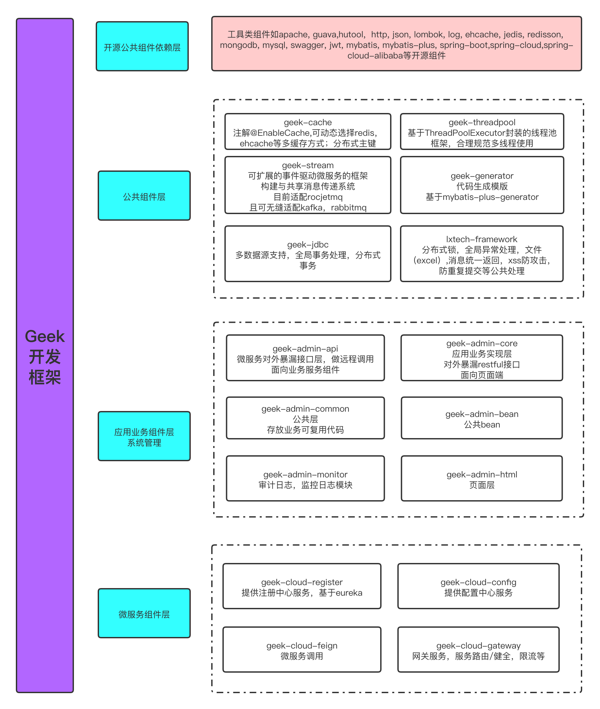

1. 在线阅读

-  **[国内优先 Gitee 在线阅读](https://mochazi.gitee.io/docsify-demo)** | [Gitee 仓库地址](https://gitee.com/mochazi/docsify-demo)
-  **[国外优先 GitHub 在线阅读](https://lee-vis.github.io/geek-doc)** | [GitHub 仓库地址](https://github.com/lee-vis/geek-doc)

2. 框架整体介绍

   框架示意图：
   
   
   
   具体介绍：

- geek-dependency-management

  公共依赖层，主要提供三方jar工具包，如apache工具包，guvaa，hutool等，及三方开源框架包如spring boot，spring cloud，spring cloud alibaba等，详见具体章节介绍

- geek-boot

  框架组件层, 主要包括缓存组件，代码模版生成组件，数据源组件，消息驱动组件，线程池组件，web层通用组件

- geek-cloud

  框架微服务层，提供配置中心，服务注册中心，网关，服务负载，熔断，限流，声明式服务调用等

- 后台管理模版

  提供后台管理基础示例，可由此延伸开发，主要包括系统管理，系统监控，系统工具，帮助手册，个人中心等；

  包含前端页面 geek-admin-front，基于ele-admin前端框架基础调整开发；
  
  后端服务geek-admin，基于geek-boot框架开发，提供服务层业务接口能力。

