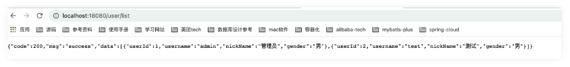

###### 1. 引入

​	对应pom文件，添加如下

```xml
<dependency>
  	<groupId>org.geek</groupId>
  	<artifactId>geek-framework</artifactId>
</dependency>
```

###### 2. 使用说明

​	2.1 提供的能力模块：

- 全局异常处理

- 统一消息返回

- web层通用配置：如swagger，跨域，安全，健康检查等

- 防重复提交

- 分布式锁

- xss防攻击过滤

- 通用工具层

  spring boot启动类Application配置

  ```java
  //配置通用层包路径
  @SpringBootApplication(scanBasePackages = {"org.geek.framework"}
  ```

  

​	2.2 全局异常处理

​		配置默认开启，业务代码不⽤⾃⼰try catch，系统⾃动捕获， 默认返回 500， message返回当前异常栈信息，若自定义异常码和异常信息，resource下创建error/errors.properties(注意目录名保持一致，不然无效),

业务层代码创建自己的业务异常信息，需继承ServiceException

```properties
#code=message
1001=账号已存在
1002=手机号已存在
1003=邮箱已存在
```

```
throw new ServiceException(1001)
```

​	2.3 统一消息返回

​		controller层添加注解@ResonseResult，则使用框架规范统一封装controller返回信息，不添加则使⽤业务代码默认返回格式



​	2.4 web层通用配置

​		默认自动加载

​	2.5 防重复提交

​		controller层method上添加注解@RepeatSubmit，可防重复提交，如果重复提交则提示不允许重复提交，请稍后再试，默认时间间隔3s

​	2.6 分布式锁

​		基于redis实现，需引入geek-cache启用redis方可生效

​		spring boot启动类Application配置

```java
//启用分布式锁
@EnableDistributedLock
//class内引入
@Autowired
private RedisLockRegistry redisLockRegistry;
//method内引入
public void testDistributeLock(){
    Lock lock = redisLockRegistry.obtain("distributeLockKey");
    log.info("lock is ready");
    try {
      TimeUnit.SECONDS.sleep(3);
    } catch (InterruptedException e) {
      log.error("testDistributeLock error",e);
    } finally {
      lock.unlock();
    }
}
```

​	2.7 xss防攻击过滤

​			默认自动加载

​	2.8 通用工具层

​			除三方组件如apache，guava，hutool等，框架内也做了扩展，提供如日期，jwt，反射，controller中	httpServletRequest和httpServletResponse处理，spring bean静态获取，资源文件加载读取，文本，html，加密处理，excel封装处理等，后续补充所有完整示例

