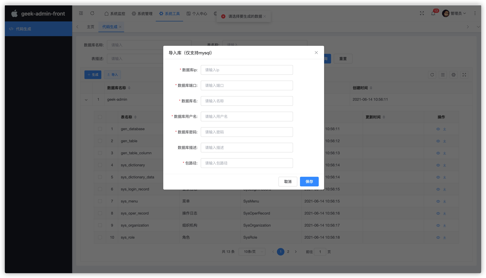
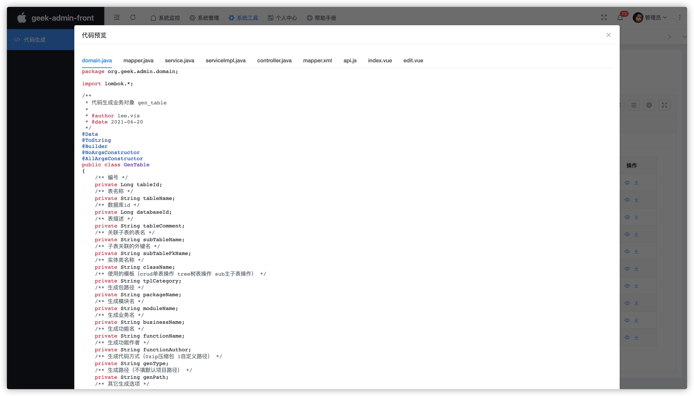

###### 1.说明

​	基于Velocity开发，是一个基于 Java 的模板引擎，可用于生成java后端controller,service,dao的mapper, xml,前端页面index.vue,edit.vue,api.js, 目的是快速生成库表增删改查前后台，简短开发周期

​	tips：框架前端由于用的eleadmin框架，是公司付费买的前端框架，如果有自己的前端框架，可以忽略前端生成文件，直接用后端代码即可

###### 2.使用说明

​	可直接配合文档`标题5 后台管理模版`使用，登入系统后，系统工具-代码生成

​	导入数据库，目前仅支持mysql

​	预览生成，直接复制需要的代码

​	导出zip包下载至本地，直接单表或多表